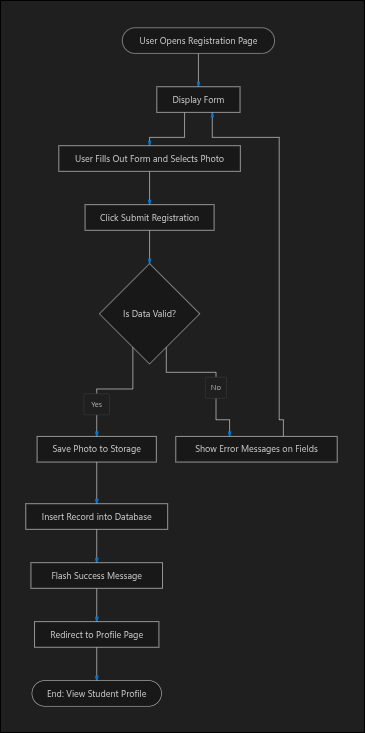
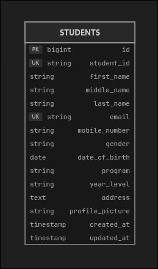
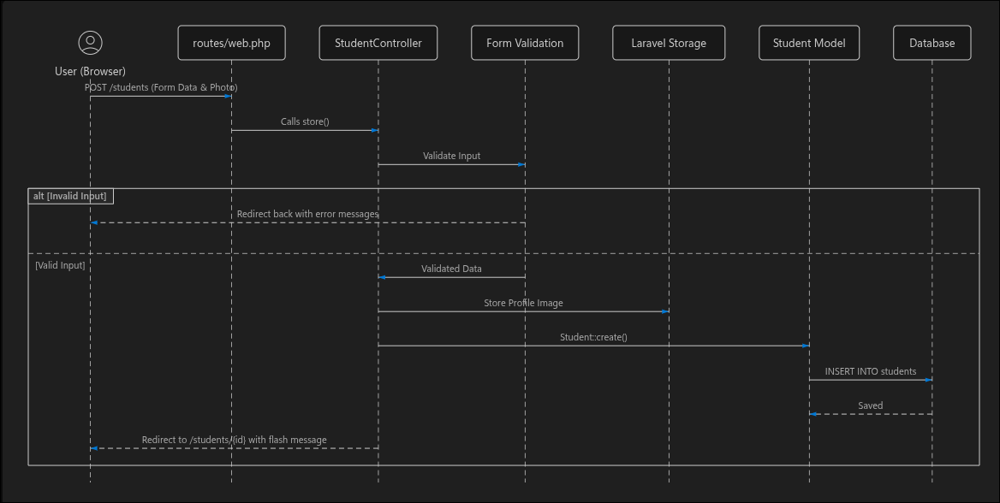

# System Architecture & Flow Diagrams
## ITST 302: Client-Server Technologies — Mini Project 03

This document contains the visual diagrams and architectural workflows for the **Student Registration System**.

---

## 1. Registration Process Flowchart

This flowchart illustrates the end-to-end user journey during student enrollment, from initial page load and form input to server validation, image storage, and database persistence.

### Workflow Steps:
1. **User Opens Form**: Browser requests `GET /students/create`.
2. **Form Entry**: User fills in identification, academic, contact details, and selects a profile picture file.
3. **Submission**: User submits the form via `POST /students`.
4. **Validation Check**:
   - **Invalid Data**: Returns back to form with field-specific red borders and error messages while retaining input via `old()`.
   - **Valid Data**: Uploads picture to `storage/app/public/profile_pictures`, inserts a new row into `students` table, and displays the submission feedback modal.

---

## 2. Database Entity Relationship Diagram (ERD)

The Entity Relationship Diagram specifies the data structure, primary keys, unique constraints, and data types used in the `students` table.

### Table Schema (`students`):
* `id` (`BIGINT`, Primary Key, Auto Increment)
* `student_id` (`VARCHAR(50)`, Unique)
* `first_name` (`VARCHAR(100)`)
* `middle_name` (`VARCHAR(100)`, Nullable)
* `last_name` (`VARCHAR(100)`)
* `email` (`VARCHAR(150)`, Unique)
* `mobile_number` (`VARCHAR(20)`)
* `gender` (`VARCHAR(20)`)
* `date_of_birth` (`DATE`)
* `program` (`VARCHAR(100)`)
* `year_level` (`VARCHAR(50)`)
* `address` (`TEXT`)
* `profile_picture` (`VARCHAR(255)`)
* `created_at` (`TIMESTAMP`)
* `updated_at` (`TIMESTAMP`)

---

## 3. Laravel Request Lifecycle Diagram

This sequence diagram depicts the internal client-server request processing across Laravel's routing engine, controllers, form request validator, local filesystem storage, and Eloquent ORM.

### Sequence Breakdown:
1. **Client (Browser)** -> Sends HTTP POST request with `multipart/form-data` payload to `/students`.
2. **Routing (`routes/web.php`)** -> Dispatches request to `StudentController@store`.
3. **Controller Validation** -> Evaluates input against rules (`required`, `email`, `unique`, `image`, `max:2048`).
4. **Filesystem Storage** -> Stores uploaded image into `storage/app/public/profile_pictures` via Laravel Storage.
5. **Eloquent Model (`Student`)** -> Persists new student entity into MySQL/SQLite database table.
6. **Response Dispatch** -> Redirects to `/students/create` with flash session data and renders the non-scrollable centered submission modal.
